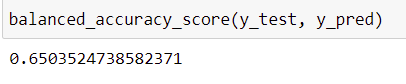
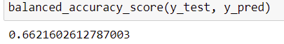
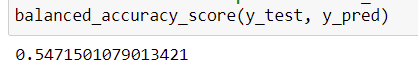
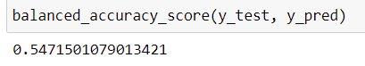
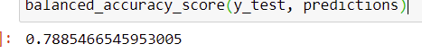
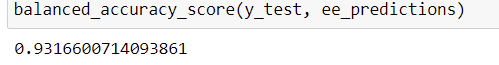
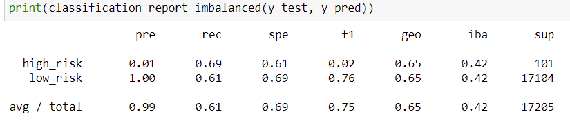
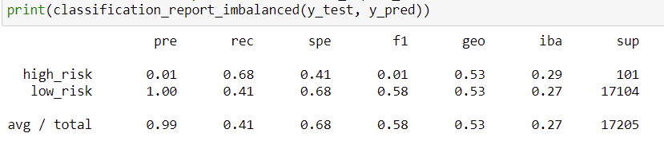
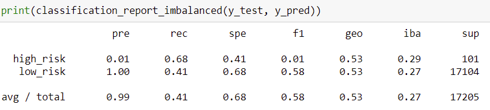
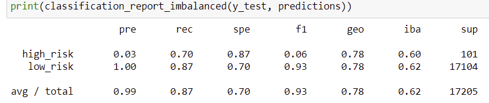

# Credit_Risk_Analysis

# Overview
The purpose of this analysis was to train and evaluate machine learning models using different resampling methods to predict credit risk. Our models took into consideration a number of variables, including but not limited to the dollar amount of the loan, interest rates, and annual income, to predict if the loan should be considered high-risk or low-risk. We can analyze the results of these models in order to determine which is the best model for predicting credit risk. 

# Results 

- As seen below, the models using Ensemble Classifiers to predict credit risk (Balanced Random Forest, Easy Ensemble) proved to have far higher balanced accuracy scores than the models that relied solely on resampling. The model using the Easy Ensemble Classifier had the highest balanced accuracy score of ~93.17%

- Random Oversampling

- SMOTE Oversampling

- Undersampling

- Combination (Over and Under) Sampling with SMOTEENN

- Balanced Random Forest Classifier

- Easy Ensemble Classifier

------------------------------------------------------------------------------------------------------------------------------------------------------------------------------

- 

- Random Oversampling

- SMOTE Oversampling

- Undersampling

- Combination (Over and Under) Sampling with SMOTEENN

- Balanced Random Forest Classifier

- Easy Ensemble Classifier

# Summary 

