# Credit_Risk_Analysis

# Overview
The purpose of this analysis was to train and evaluate machine learning models using different resampling methods to predict credit risk. Our models took into consideration a number of variables, including but not limited to the dollar amount of the loan, interest rates, and annual income, to predict if the loan should be considered high-risk or low-risk. We can analyze the results of these models in order to determine which is the best model for predicting credit risk. 

# Technologies Used
- Technologies utilized in this analysis include: Python, Pandas, NumPy, Scikit Learn, imblearn, Jupyter Notebook

# Results 

- As seen below, the models using Ensemble Classifiers to predict credit risk (Balanced Random Forest, Easy Ensemble) proved to have far higher balanced accuracy scores than the models that relied solely on resampling. The model using the Easy Ensemble Classifier had the highest balanced accuracy score of ~93.17%

- Random Oversampling

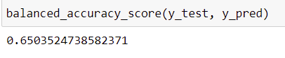

- SMOTE Oversampling

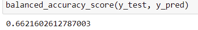

- Undersampling

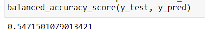

- Combination (Over and Under) Sampling with SMOTEENN

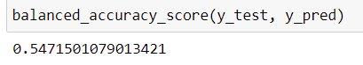

- Balanced Random Forest Classifier

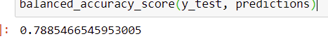

- Easy Ensemble Classifier

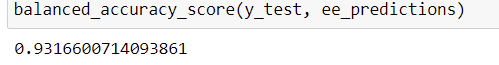

------------------------------------------------------------------------------------------------------------------------------------------------------------------------------

- Looking at the imbalanced classification reports for the six models, again we see that the ensemble classifiers predict credit risk more accurately than those solely relying on resampling. the precision metrics are higher for both models using Ensemble classifiers than the other four, and the F1 scores for the models using Ensemble Classifiers are higher than the rest of the models as well. The model with the highest F1 score is the model using the Easy Ensemble Classifier with an F1 score of .97.

- Random Oversampling

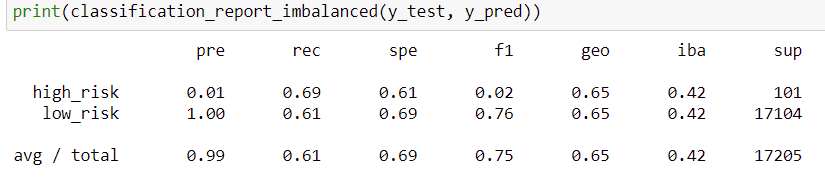

- SMOTE Oversampling

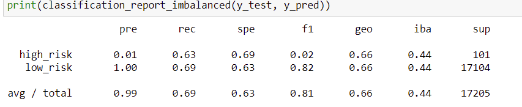

- Undersampling

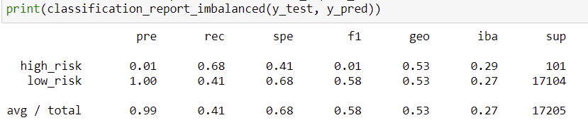

- Combination (Over and Under) Sampling with SMOTEENN

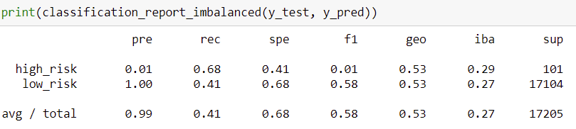

- Balanced Random Forest Classifier

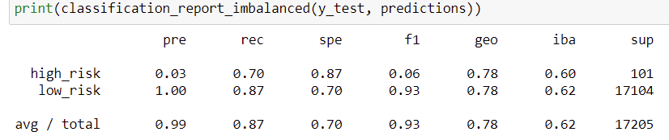

- Easy Ensemble Classifier

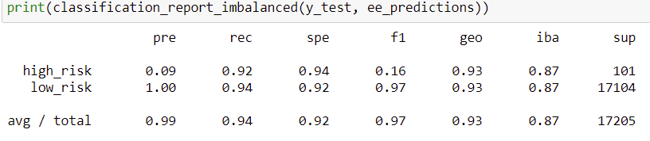

# Summary 
- After viewing the results of our models, we see that the models using Ensemble Classifiers are much better for predicting credit risk. With higher measures for precision, recall, and F1 scores, we see the value that combining models creates in improving the accuracy and robustness of models. 
- If I were to make a reccomendation for a model based on these results, I would reccomend the Easy Ensemble Classifier. With the highest measures for balaced accuracy, as well as the highest F1 score, it would make sense to use this model to predict credit risk. 
